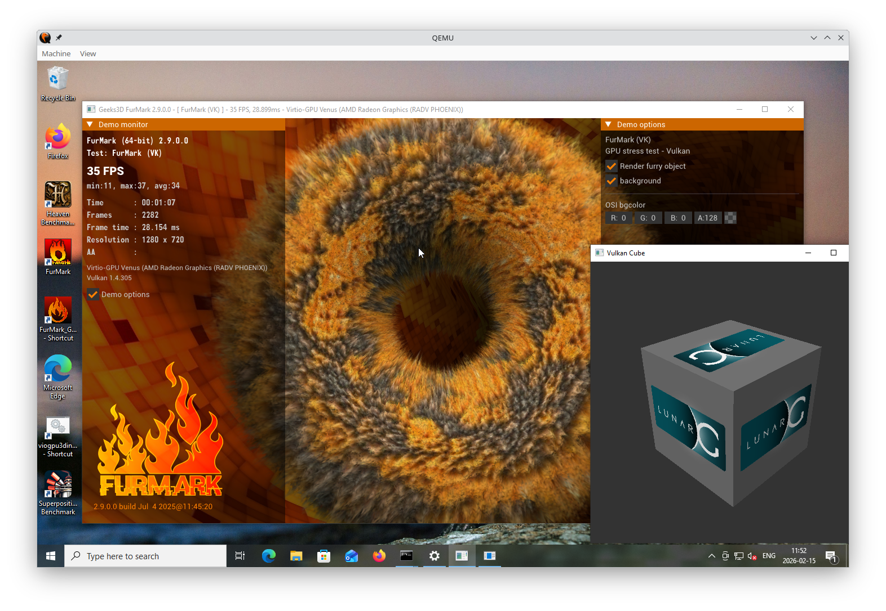

# About

This project is an effort to bring paravirtualized 3d acceleration to Windows guests. Right now it provides OpenGL/Virgl and Vulkan/Venus in addition to llvmpipe and lavapipe.

Also note this project is still under development and there are numerous bugs that will crash or hang the guest so **do not use it** for produciton work.

Any contributions are welcome. I will happily **take merge requests**. In this project there are only two rules:

1.  It builds and run
2.  Avoid touching mesa core code



# Win10 viogpu3d driver installation

Install VirtIOTestCert.cer in Trusted Root Certification Authorities  
_The certificate is provided in the zip file or in the source tree_  

Disable secure boot in UEFI settings  

Enable test signing mode and reboot  
_bcdedit /set testsigning on_  

Install Windows Graphics Tools  
_Settings -> Apps -> Optional features -> Add a feature and search for "Graphics Tools"._  
_Click Install_

Windows graphics tools is apparently required for debug builds...  

Install the viogpu3d driver  
_Open device manager and select the display adapter -> Update driver -> Browse my computer for drivers._

If you have an old version of the viogpu3d driver first uninstall it and make sure to delete the old driver.

# Vulkan Runtime installer

*   Download and run the Vulkan Runtime Installer from [https://vulkan.lunarg.com/sdk/home](https://vulkan.lunarg.com/sdk/home)  
    _The Vulkan Runtime provides the vulkan-1.dll loader and vulkaninfo utility_

# Linux host requirements

*   To use Vulkan/Venus with qemu, virglrenderer on the host has to be built with venus support.  
    _Tip: To make sure your host environment is correct try first installing an Ubuntu guest with venus enabled and run for instance vkcube._

```
meson setup build -Dvenus=true
meson compile -C build
meson install -C build
```

# QEMU setup

*   For QEMU to be able to use Vulkan/Venus the guest VM needs host shared memory enabled. Below is an example:

```
IMG=win10-box.qcow2
ISO=Win10_22H2_English_x64.iso

qemu-system-x86_64                                               \
    -enable-kvm                                                  \
    -smp 4                                                       \
    -m 8G                                                        \
    -cpu host,migratable=on,hv-time=on,hv-relaxed=on,hv-vapic=on,hv-spinlocks=0x1fff \
    -machine pc-q35-8.0,usb=off,vmport=off,dump-guest-core=off,memory-backend=mem1,hpet=off,acpi=on \
    -net nic,model=e1000e                                        \
    -net user,hostfwd=tcp::2222-:22                              \
    -device virtio-vga-gl,hostmem=4G,blob=true,venus=true        \
    -vga none                                                    \
    -boot strict=on                                              \
    -display gtk,gl=on,show-cursor=off                           \
    -usb -device usb-tablet                                      \
    -chardev pty,id=charserial0                                  \
    -device '{"driver":"isa-serial","chardev":"charserial0","id":"serial0","index":0}' \
    -chardev socket,id=charserial1,path=/tmp/windbg              \
    -device '{"driver":"isa-serial","chardev":"charserial1","id":"serial1","index":1}' \
    -object memory-backend-memfd,id=mem1,size=8G,share=on        \
    -hda $IMG                                                    \
    -cdrom $ISO                                                  \
    -chardev socket,id=chr-vu-fs0,path=fs0-fs.sock               \
    -device '{"driver":"vhost-user-fs-pci","id":"fs0","chardev":"chr-vu-fs0","tag":"temp"}' \
    -d guest_errors
```

# Testing

*   Install FurMark 2

```
cd <insert path here>\FurMark_2.9.0.0_win64\FurMark_win64

furmark --demo furmark-vk

furmark --demo furmark-gl
```

*   There is also a modified version of vkcube in a adjacent repository (vulkan-tools)

# KVM/QEMU Windows guest drivers (virtio-win)

This repository contains KVM/QEMU Windows guest drivers, for both  
paravirtual and emulated hardware. The code builds and ships as part  
of the virtio-win RPM on Fedora and Red Hat Enterprise Linux, and the  
binaries are also available in the form of distribution-neutral ISO  
and VFD images. If all you want is use virtio-win in your Windows  
virtual machines, go to the  
[Fedora virtIO-win documentation](https://docs.fedoraproject.org/en-US/quick-docs/creating-windows-virtual-machines-using-virtio-drivers/index.html)  
for information on obtaining the binaries.

If you'd like to build virtio-win from sources, clone this repo and  
follow the instructions in [Building the Drivers](https://virtio-win.github.io/Development/Building-the-drivers-using-Windows-11-24H2-EWDK).  
Note that the drivers you build will be either unsigned or test-signed  
with Tools/VirtIOTestCert.cer, which means that Windows will not load  
them by default. See [Microsoft's driver signing page](https://docs.microsoft.com/en-us/windows-hardware/drivers/install/installing-test-signed-driver-packages)  
for more information on test-signing.

If you want to build cross-signed binaries (like the ones that ship in  
the Fedora RPM), you'll need your own code-signing certificate.  
Cross-signed drivers can be used on all versions of Windows except for  
the latest Windows 10 with secure boot enabled. However, systems with  
cross-signed drivers will not receive Microsoft support.

If you want to produce Microsoft-signed binaries (fully supported,  
like the ones that ship in the Red Hat Enterprise Linux RPM), you'll  
need to submit the drivers to Microsoft along with a set of test  
results (so called WHQL process). If you decide to WHQL the drivers,  
make sure to base them on commit eb2996de or newer, since the GPL  
license used prior to this commit is not compatible with WHQL.  
Additionally, we ask that you make a change to the Hardware IDs so  
that your drivers will _not_ match devices exposed by the upstream  
versions of KVM/QEMU. This is especially important if you plan to  
distribute the drivers with Windows Update, see the  
[Microsoft publishing restrictions](https://docs.microsoft.com/en-us/windows-hardware/drivers/dashboard/publishing-restrictions) for more details.

---